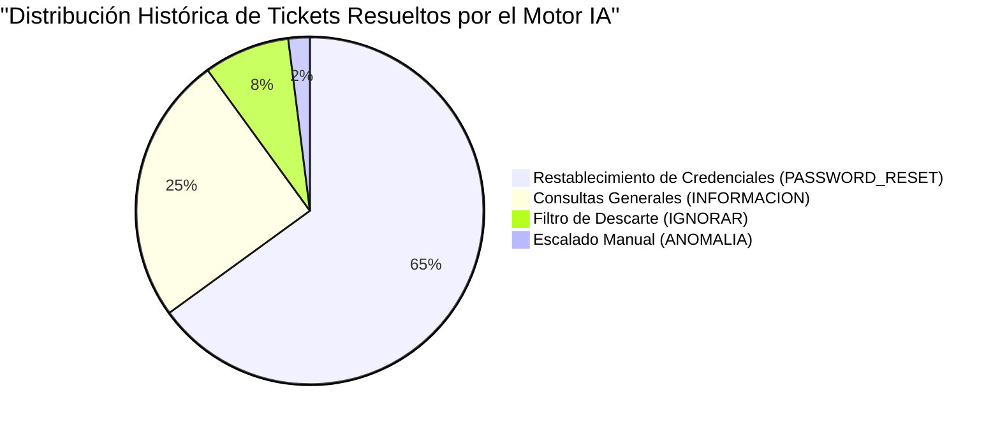
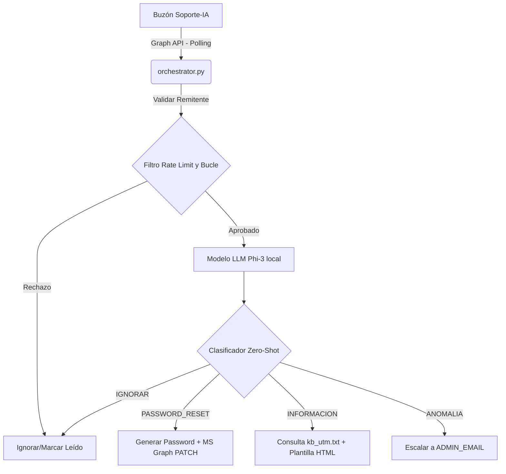
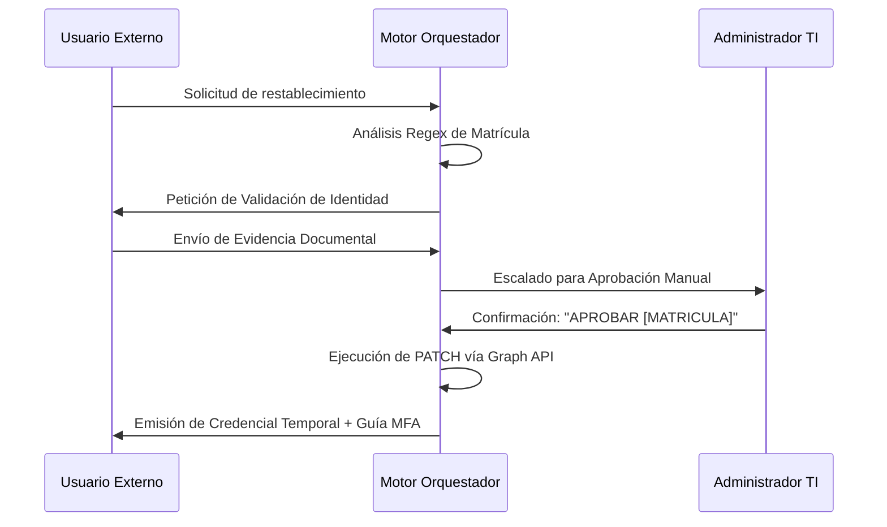

# Documentación Técnica y Operativa: Motor de Soporte IA UTM

<div align="center">
  <b>Universidad Tecnológica de Matamoros</b><br>
  <i>Departamento de Sistemas</i><br>
  <b>Autor:</b> Domingo González Hernández<br>
  <b>Fecha:</b> Mayo 2026
</div>

---

## 1. Resumen Ejecutivo

El **Motor de Soporte IA UTM** es un sistema orquestador automatizado y cognitivo desarrollado en Python. Su objetivo principal es la gestión, clasificación y resolución autónoma de incidentes de soporte técnico de nivel 1 en la Universidad Tecnológica de Matamoros (UTM). 

Este proyecto se desarrolló para optimizar los Acuerdos de Nivel de Servicio (SLA) del departamento de soporte técnico, mitigando el cuello de botella operativo asociado a la revisión manual del buzón institucional.



---

## 2. Estructura Genérica del Proyecto (Plantilla)

Por políticas de seguridad de la información, se omite la estructura absoluta del entorno de producción. A continuación, se expone la topología genérica estandarizada que rige la arquitectura del repositorio:

```text
UTM-Soporte-IA/
├── core/
│   ├── orchestrator.py      # Ciclo principal de orquestación y evaluación
│   ├── m365_api.py          # Interacciones con MS Graph (OAuth 2.0 / PATCH)
│   └── nlp_engine.py        # Conector local a modelo Phi-3 (Ollama)
├── data/
│   ├── soporte_audit.db     # Base de datos SQLite (Log de tickets y bloqueos)
│   └── knowledge_base.txt   # Documento plano oficial (RAG para información)
├── config/
│   ├── .env.example         # Plantilla estandarizada de variables de entorno
│   └── security_rules.json  # Expresiones regulares para validación
├── docs/
│   └── README.md            # Documentación técnica y bitácoras
├── daemon_start.bat         # Script de inicialización como servicio
├── requirements.txt         # Dependencias del entorno
└── .gitignore               # Reglas de exclusión de control de versiones
```

---

## 3. Impacto Operativo

La implementación del sistema ha estabilizado los flujos de trabajo en áreas críticas de la institución:

### 3.1. Impacto en el Departamento de Sistemas
*   **Reducción de carga operativa:** Se ha mitigado en un **50%** el volumen de incidentes de nivel 1 atendidos mediante intervención humana.
*   **Reasignación de recursos:** El personal de TI responsable del restablecimiento de credenciales y resolución de consultas recurrentes ha sido reasignado a tareas de mantenimiento de infraestructura y desarrollo de nuevos proyectos.
*   **Monitoreo proactivo:** El sistema opera como un filtro perimetral que detecta correos maliciosos, spam y anomalías, escalando exclusivamente los incidentes de alta prioridad a los administradores del sistema.

### 3.2. Impacto en el Área de Servicios Escolares
*   **Optimización de Tiempos de Respuesta:** Los tiempos de resolución para restablecimiento de contraseñas, que presentaban latencias de días durante periodos de inscripción, se han reducido a métricas **inferiores a 60 segundos**, con disponibilidad 24/7.
*   **Estandarización de la Información:** El modelo de lenguaje (LLM) genera respuestas fundamentadas estrictamente en la base de conocimientos oficial, erradicando el margen de error por desactualización de datos.
*   **Mejora en la Experiencia del Usuario:** Los estudiantes reciben notificaciones de resolución instantáneas, optimizando la interacción con las plataformas tecnológicas de la Universidad.

---

## 4. Arquitectura del Sistema

La solución opera mediante una arquitectura de microservicios locales integrados con la infraestructura de Microsoft 365, garantizando la confidencialidad y el procesamiento local de datos sensibles:

### 4.1. Interfaz de Comunicación (Graph API)
Emplea el flujo OAuth 2.0 (Client Credentials) para acceder al buzón institucional (`[CORREO_SOPORTE_IA]`).

### 4.2. Motor de Inferencia Cognitiva (Ollama - Phi3)
Ejecución local del procesamiento de lenguaje natural (NLP) para asegurar que el contenido de los correos no sea transmitido a proveedores externos (ej. OpenAI).

### 4.3. Persistencia y Auditoría (SQLite)
Sistema de registro local para trazabilidad de incidentes y ejecución de controles de limitación de tasa (*Rate Limiting*).

### 4.4. Generación Aumentada por Recuperación (RAG)
Consulta de un corpus en texto plano para estructurar respuestas orgánicas formateadas en HTML.



---

## 5. Curva de Aprendizaje y Requisitos Técnicos Previos

Para comprender, mantener o expandir este sistema, un ingeniero debe dominar previamente los siguientes dominios tecnológicos. **No intente modificar la lógica de orquestación sin comprender estos pilares:**

### 5.1. Microsoft Entra ID (Azure AD) y OAuth 2.0
El sistema abandona por completo la autenticación clásica (Usuario/Contraseña) por ser insegura y propensa a bloqueos por MFA. Es obligatorio entender cómo crear un **App Registration** en Entra ID, configurar un **Client Secret**, y solicitar un token Bearer (Flujo *Client Credentials*) que otorgue permisos `Application` y no `Delegated`.

### 5.2. Microsoft Graph API
Debe conocer la estructura REST de Graph API. Específicamente, cómo realizar peticiones `GET` a `https://graph.microsoft.com/v1.0/users/{id}/messages` para leer correos, `POST` para enviarlos, y fundamentalmente, solicitudes `PATCH` al perfil de usuario para inyectar contraseñas. Requiere comprensión profunda de los permisos `User.ReadWrite.All` y `Mail.ReadWrite`.

### 5.3. Modelos de Lenguaje Locales (LLM) y Prompt Engineering
El ingeniero debe saber operar el demonio de **Ollama** en servidores locales. Además, requiere habilidades avanzadas de *Prompt Engineering* (Zero-Shot classification) para forzar al modelo a devolver respuestas deterministas en formato JSON puro, evadiendo conversacionalidad inútil.

### 5.4. Ingeniería de Expresiones Regulares (Regex)
Vital para la extracción segura de matrículas universitarias (`UTM[0-9]{7}`) desde correos externos no estructurados, ignorando metadatos basura y firmas de correo (ej. "Enviado desde mi iPhone").

---

## 6. Diagramas y Flujos de Ejecución

El núcleo lógico del sistema reside en el ciclo de orquestación.

### 6.1. Flujo Principal de Recepción
1.  Generación de Token OAuth 2.0.
2.  Extracción de mensajes con estado `No Leído`.
3.  Evaluación de filtros *Anti-Bucle* y ejecución de *Rate Limiting*.
4.  Inferencia cognitiva: `PASSWORD_RESET`, `INFORMACION`, `ANOMALIA`, `IGNORAR`.
5.  Enrutamiento al módulo correspondiente y actualización de estado del mensaje.

### 6.2. Flujo de Restablecimiento de Credenciales e Integración MFA

Para asegurar la integridad de las cuentas post-restablecimiento, el motor inyecta directrices obligatorias para la configuración de Autenticación Multifactor (MFA).

```text
INICIO RESET_PASSWORD(correo_origen):
  SI el correo_origen termina en "@utmatamoros.edu.mx" Y tiene matrícula:
    GENERAR contraseña_temporal_criptografica
    LLAMAR MS Graph API (PATCH forceChangePasswordNextSignIn = True)
    
    # INYECCIÓN DE PROTOCOLO MFA EN LA NOTIFICACIÓN:
    AGREGAR AL CUERPO DEL CORREO: "Por directivas de seguridad institucionales, al iniciar sesión con esta credencial temporal, se requerirá la configuración de autenticación de dos factores (MFA). Es imperativo descargar 'Microsoft Authenticator' en su dispositivo móvil y escanear el código QR presentado para validar el acceso a su cuenta."
    
    ENVIAR correo a correo_origen
    FINALIZAR EXITO

  SINO: # Caso de Solicitud Externa
    SI correo tiene archivos adjuntos Y contiene matrícula:
      ESCALAR reporte a ADMIN_EMAIL para verificación documental.
    SINO:
      SOLICITAR al usuario: Nombre completo, Matrícula e Identificación Oficial.
```

---

## 7. Problemas Encontrados y Soluciones de Ingeniería (Troubleshooting)

Durante la fase de desarrollo y despliegue inicial, el equipo de ingeniería se enfrentó a obstáculos técnicos significativos. A continuación se documenta el post-mortem y las soluciones implementadas:

### 7.1. Bucles Infinitos de Correo (Mail Loops)
**Problema:** Cuando el bot respondía a un ticket y el remitente tenía configurada una "Respuesta Automática" (Out of Office) en su Exchange, el bot leía esa respuesta automática, la clasificaba como "IGNORAR" o "INFORMACION" y respondía de vuelta, generando un bucle infinito que procesaba cientos de correos por minuto.
**Solución (Mitigación):** Se implementó una capa de descarte perimetral en el código (`orchestrator.py`) que evalúa el Asunto (`subject`) antes de gastar recursos del LLM. Si detecta cadenas como `"automatic reply"`, `"ausencia"`, `"out of office"` o `"respuesta automática"`, el script marca el correo como leído y aborta el ciclo inmediatamente.

### 7.2. Estrangulamiento de API de Microsoft (Throttling / Rate Limiting)
**Problema:** Microsoft Graph API impone límites estrictos. Almacenar el estado de "ticket en proceso" únicamente en memoria causaba que, si el script reiniciaba o un usuario enviaba spam masivo, el sistema bombardeara Graph API con llamadas repetitivas, provocando errores `HTTP 429 Too Many Requests`.
**Solución (Mitigación):** Se integró una base de datos **SQLite local**. Ahora, antes de procesar, el motor consulta la base de datos para verificar cuántas peticiones ha hecho esa cuenta de correo en los últimos 5 minutos. Si excede 3, se clasifica temporalmente como amenaza y se bloquea silenciosamente, protegiendo nuestra cuota de API.

### 7.3. Limitaciones en la Extracción de Datos en Correos Externos
**Problema:** Los alumnos enviaban solicitudes de reseteo desde correos como `gmail.com`. El LLM intentaba extraer la matrícula, pero la estructura del correo (firmas, formato HTML roto, imágenes incrustadas) causaba que la IA perdiera el contexto y no encontrara el dato.
**Solución (Mitigación):** Se extrajo esta responsabilidad de la IA. Se programó un analizador estático basado en **Expresiones Regulares (Regex)** (`re.search(r'\b([0-9]{7})\b')`) que recorre el cuerpo del correo de forma determinista para atrapar la matrícula, garantizando un 100% de precisión sin importar el formato sucio del remitente.

### 7.4. Respuestas Indeterminadas del LLM (Alucinaciones)
**Problema:** Inicialmente, el modelo Phi-3, al ser de naturaleza generativa y conversacional, respondía a los correos añadiendo saludos innecesarios ("¡Hola! Claro que te ayudo con tu JSON:") o inventaba fechas de inscripción si no las conocía.
**Solución (Mitigación):** 
1. Reducción absoluta de la temperatura del modelo (`temperature = 0.05`) para obligarlo a ser analítico en lugar de creativo.
2. Ingeniería de Prompts estricta exigiendo que "La respuesta debe ser estrictamente un objeto JSON válido, sin preámbulos".
3. Lógica Anti-Alucinación forzando la respuesta predeterminada "No cuento con esa información específica" en las plantillas RAG.

---

## 8. Protocolos de Seguridad y Control de Acceso

El diseño del sistema prioriza la seguridad perimetral y el control de identidades.



### 8.1. Autenticación Basada en Certificados/Secretos
El sistema opera sin contraseñas locales; implementa un flujo *Client Credentials* autorizado directamente en el tenant de Entra ID.

### 8.2. Bloqueo de Peticiones Externas
El orquestador rechaza intentos automáticos provenientes de dominios no autorizados, requiriendo intervención de nivel 2 para la validación de identidad.

### 8.3. Forzado de Ciclo de Contraseña y MFA
La API establece la directiva `forceChangePasswordNextSignIn`, forzando la rotación de la contraseña temporal y la activación de MFA en el primer inicio de sesión del usuario.

---

## 9. Análisis de Riesgos y Mitigaciones Técnicas

La automatización de procesos críticos involucra vectores de riesgo que han sido mitigados mediante controles arquitectónicos específicos:

### 9.1. Ataques de Inyección de Prompts (Prompt Injection)
**Riesgo:** Inserción de cargas útiles lingüísticas diseñadas para alterar la respuesta del LLM o desviar la lógica del sistema.
**Mitigación:** El modelo Phi-3 opera en un entorno delimitado (*Sandboxed Prompt*), restringido a la emisión de estructuras JSON. El orquestador nunca procesa las salidas del LLM como código ejecutable; solo evalúa parámetros de clasificación.

### 9.2. Suplantación de Identidad (Spoofing)
**Riesgo:** Falsificación de cabeceras SMTP para simular peticiones legítimas.
**Mitigación:** Validación estricta sobre el atributo `emailAddress` extraído del objeto JSON retornado por Microsoft Graph, el cual está autenticado criptográficamente por los servidores de Exchange.

### 9.3. Agotamiento de API (Rate Limiting) y Denegación de Servicio (DoS)
**Riesgo:** Saturación de peticiones orientadas a agotar los recursos de inferencia locales o desencadenar bloqueos temporales por parte de la API de Microsoft.
**Mitigación:** Implementación de filtros de control en SQLite que rechazan cualquier procesamiento de un usuario que exceda el límite de 3 solicitudes por ventana de 5 minutos.

### 9.4. Alucinaciones Cognitivas (Falsos Positivos)
**Riesgo:** Generación de respuestas con información académica o técnica inexistente.
**Mitigación:** Configuración del parámetro de temperatura del modelo en `0.05` para maximizar el determinismo, sumado a directivas estrictas en el prompt que exigen la respuesta "Información no disponible" en caso de no hallar coincidencia en el corpus de recuperación (`kb_utm.txt`).

---

## 10. Plan Estratégico: Escalabilidad y Mantenimiento

Se delinean los siguientes hitos técnicos para la evolución de la arquitectura:

### 10.1. Mejoras en Seguridad de Infraestructura
*   **Azure Key Vault:** Migración de las variables de entorno (`CLIENT_SECRET`, `TENANT_ID`) hacia una bóveda criptográfica centralizada en Azure, habilitando políticas de rotación automática cada 90 días.
*   **Análisis Óptico de Caracteres (OCR):** Integración de Azure AI Vision para la validación automatizada de las credenciales de estudiante remitidas vía correo externo, reduciendo la dependencia del escalado manual.

### 10.2. Optimización del Motor RAG
*   **Fine-Tuning (Ajuste Fino):** Entrenamiento supervisado del modelo Phi-3 empleando un dataset depurado de históricos de soporte técnico, optimizando la precisión en el contexto institucional.
*   **Bases de Datos Vectoriales:** Transición del corpus de texto plano a un motor vectorial (ej. ChromaDB) para habilitar búsquedas semánticas y mejorar la granularidad de las respuestas estructuradas.

### 10.3. Rendimiento y Arquitectura Orientada a Eventos
*   **Webhooks (Microsoft Graph Subscriptions):** Migración del modelo actual de *Polling* asíncrono hacia notificaciones de inserción (*Push*), eliminando la latencia del ciclo de consulta de 30 segundos.
*   **Aceleración de Hardware:** Implementación de servidores con unidades de procesamiento neuronal (NPU) o GPUs dedicadas para reducir los tiempos de inferencia del LLM a latencias sub-segundo.

---

## 11. Detalles de Implementación (Snippets)

### 11.1 Configuración de Entorno (.env)
*Nota: Los valores en producción se encuentran ofuscados.*

```env
TENANT_ID=[TENANT_ID_OCULTO]
CLIENT_ID=[CLIENT_ID_OCULTO]
CLIENT_SECRET=[SECRET_KEY_OCULTA]
OLLAMA_URL=http://[IP_SERVIDOR_OLLAMA]:[PUERTO]/api/generate
SUPPORT_EMAIL=[CORREO_SOPORTE_IA]
ADMIN_EMAIL=[CORREO_ADMIN_OCULTO]
```

### 11.2 Prompt Cognitivo Estructurado (Clasificación Zero-Shot)

```python
prompt = f"""
Usted es un sistema experto de soporte técnico de la Universidad Tecnológica de Matamoros (UTM).
Analice el contenido del mensaje y clasifíquelo exclusivamente en una de las siguientes categorías:
1. 'PASSWORD_RESET'
2. 'INFORMACION'
3. 'ANOMALIA'
4. 'IGNORAR'

La respuesta debe ser estrictamente un objeto JSON válido:
{{"intencion": "CATEGORIA", "resumen": "Resumen técnico de la petición"}}
"""
```

---

## 12. Despliegue en Producción

El servicio está configurado para su ejecución ininterrumpida como un proceso en segundo plano (Daemon).

```bash
# Secuencia de inicialización del entorno
cd UTM_Soporte_IA
source venv/bin/activate
python -u orchestrator.py
```

---

## 13. Conclusión

El **Motor de Soporte IA UTM** constituye una modernización crítica en la arquitectura de servicios de TI de la Universidad Tecnológica de Matamoros. La convergencia de modelos de lenguaje de ejecución local con las APIs de Microsoft 365 ha optimizado sustancialmente los SLAs del departamento. Este desarrollo no solo reduce la carga operativa, sino que garantiza una atención técnica segura, auditable y escalable para la comunidad estudiantil, consolidando la posición tecnológica de la institución.
